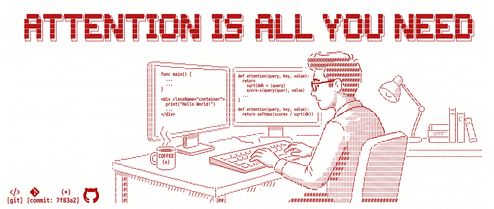

  

<h1 align="center">Hi, I'm Harshh.</h1>

  

  
  

---

`$ whoami`
CS undergraduate @ IEM Kolkata

> interested in      backend · cybersecurity · software engineering
> building            practical projects from scratch
> learning            Java · DSA · backend systems · security · AI
> mindset             learn → build → improve

  

---

### Tech Stack

  
  
  
   
  
  
  
   
  
  
   
  

